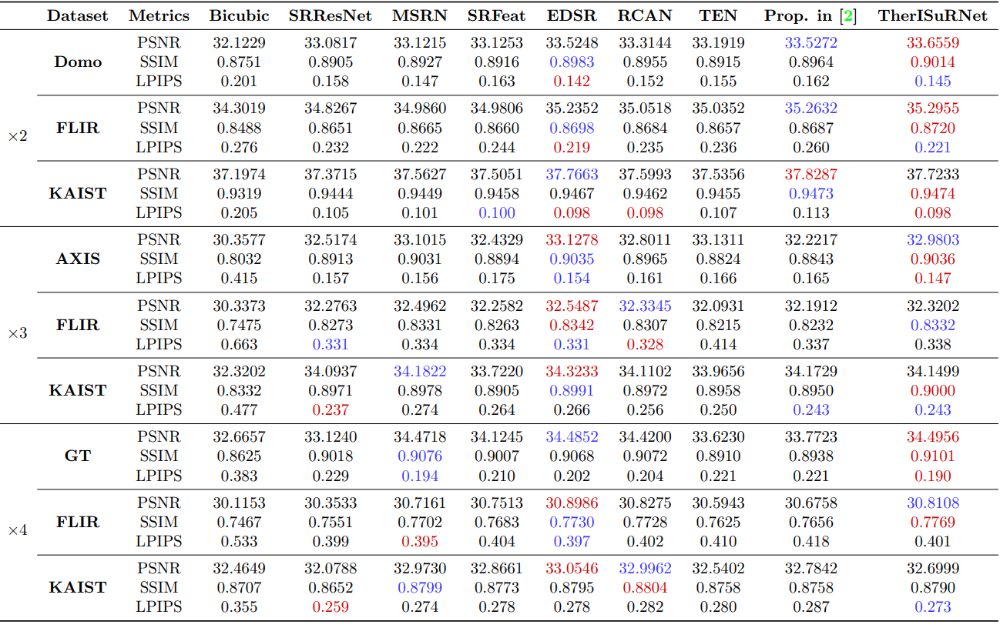

Download the paper TherISuRNet - A Computationally Efficient Thermal Image Super-Resolution Network - 
[Paper - CVPRW](https://openaccess.thecvf.com/content_CVPRW_2020/papers/w6/Chudasama_TherISuRNet_-_A_Computationally_Efficient_Thermal_Image_Super-Resolution_Network_CVPRW_2020_paper.pdf)

## Network desing of the proposed TherISuRNet model:
<br>

<br>
## Residual network:
<br>

<br>
## Usage 

1. Download dataset from [PBVS Training dataset.](https://drive.google.com/file/d/17kZOAQqRBVH7o4S87RtD90-P51iWeDFV/view?usp=sharing)

  download the following four.

* Train Data bicubic downscaling x4 (LR images)
* Train Data (HR images)
* Validation Data bicubic downscaling x4 (LR images)
* Validation Data (HR images)

  Put the downloaded dataset in the train_lr, train_hr, val_lr and val_hr folders.
  like this
```
...
│
├── train_lr
│     ├── 1.png
│     ├── 2.png
│     ├── ...
├── train_hr
│     ├── 1.png
│     ├── 2.png
│     ├── ...
├── val_lr
│     ├── 1.png
│     ├── 2.png
│     ├── ...
├── val_hr
│     ├── 1.png
│     ├── 2.png
│     ├── ...
├── main.py
├── model.py
...

```
2. Download the "imagenet-vgg-verydeep-19.mat" file from 
[https://drive.google.com/file/d/1tMZ59K4wTunDnkxNBREXR_c00hyMwyWY/view?usp=sharing] 
```

```
3. Train TherISuRNet model.

```
python main.py
```

4. After training, inference can be performed.

Put the images you want to evaluate into a test folder and run the following.

example:
 ```
 ...
│
├── main.py
├── pred.py
├── model
│     ├── checkpoint
│     ├── model.ckpt-100000
│     ├── model.ckpt-100000
│     └── model.ckpt-100000
├── test
│     ├── yourpic1.png
│     ├── favpic.jpg
│     ...
│     └── smallpic.png
...
```

```
python pred.py test
```

Download the testing LR and HR images from here 

[PBVS Validation dataset :](https://drive.google.com/file/d/1-0zhyiseHB5B9ha41zIHggUpUJ5BAHJx/view?usp=sharing) 50 number of images [1]

[FLIR Validation dataset :](https://drive.google.com/file/d/1urP-f3EhehwqY-kjSQkVc0qWgTwd9fzC/view?usp=sharing) 1366 number of images

[KAIST Validation dataset :](https://drive.google.com/file/d/1QPBnbjbLIubw_4xni1YgqoauvZ1_v4Gx/view?usp=sharing) 500 preprocessed images

## Result examples

The SR results of the TherISuRNet model can be downloaded from [here.](https://drive.google.com/file/d/1JbkX842TsWZcbxecu7Wr7rVOo-C8Rd2K/view?usp=sharing)

### Computationally Efficiency Comparison


### Quantitative Comparison


